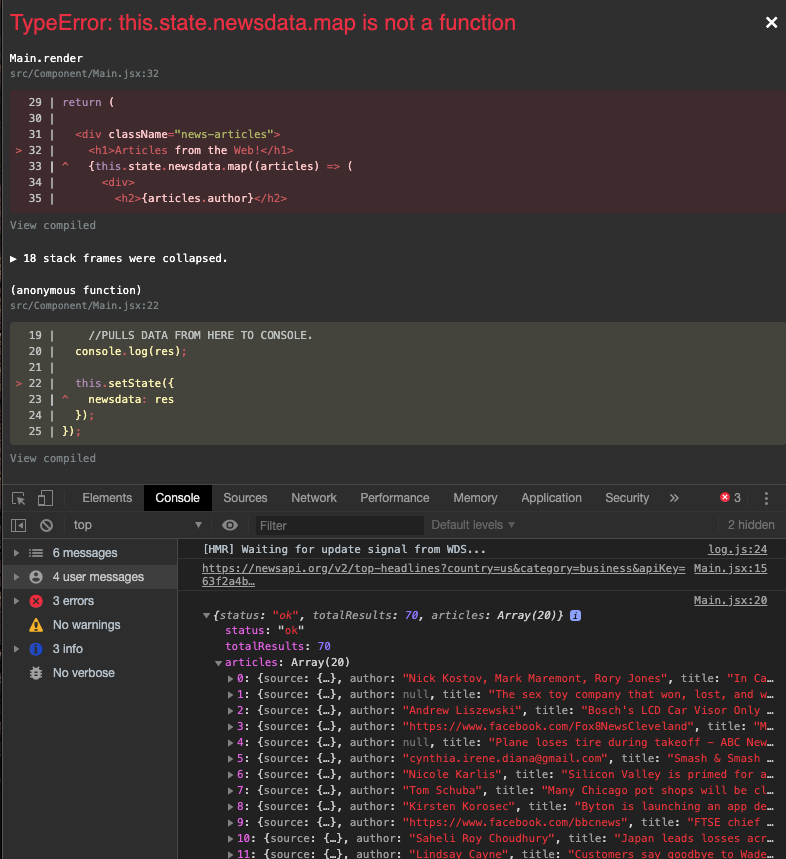
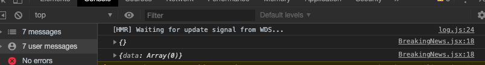
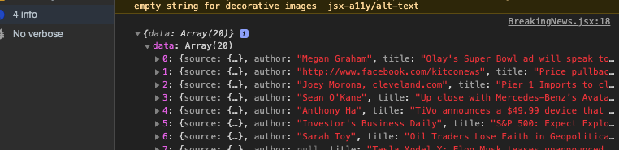
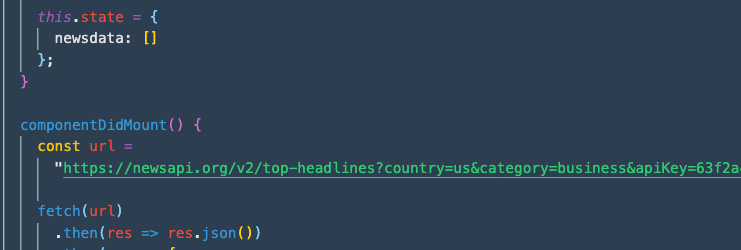
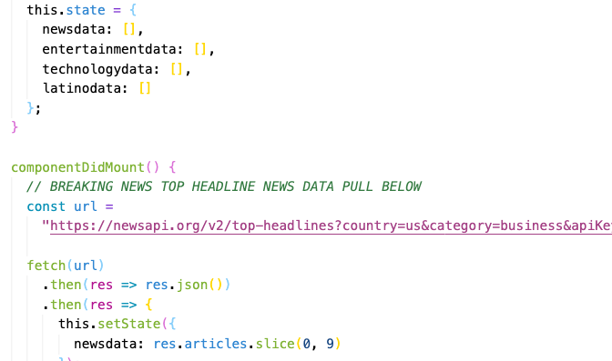
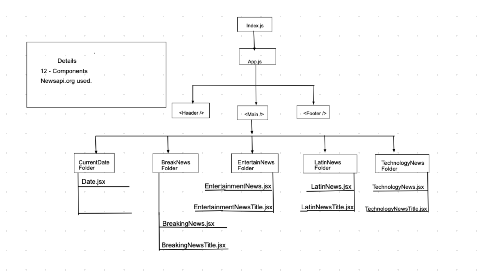
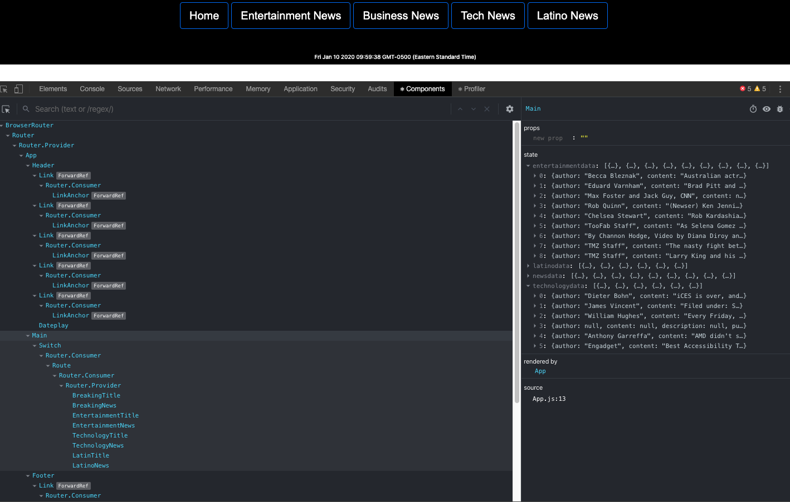

# Project Overview

# Project Description

The project two API I have chosen is News.org-api. I am looking to add eight components to the project. Within the eight components, five will pull data in order to populate their section of the application with news information. the final project goal is to make it look like the first image below. Individual users are able to click on the news data and read the articles which is redirected to a new popup window to read. Examples sites are below:

CNN: https://www.cnn.com
Dailymail: https://www.dailymail.co.uk/ushome/index.html
El Vocero: https://www.elvocero.com

# Project Links

github repo: https://github.com/pmorales4/project2-react-api
Deployment Link: https://pmorales.netlify.com

# Wireframes

This is my first mockup shot of what I thought about when starting this project, I have the final version towards the bottom for viewing purposes. These are all React Components.

Above is the layout of my components and how the site will use the components on a web page. I have labeled each section on thew wireframe. All components are listed above. To the right you will see five components where a data pull will be used (state)-Component #6. However, this may change as I am going forward with it.

# MVP / PostMVP - 5min

MVP Example

- API: https://newsapi.org/v2/top-headlines?country=us&category=business&apiKey=63f2a4bf5bdd42b3bf1f0851aa78b335

- API: Several different ones per section on website. _[ERROR PRONE HERE AS YOU SHOULD HAVE 1 API AND LOOPING IT WITH DATA]_
- User can click on news links.

- Pictures shows where API data will be put on site.

# Components

| Component                |                      Description                       |
| ------------------------ | :----------------------------------------------------: |
| App                      |     This will have all the component links to site     |
| Header                   | This will render the header include the Data and title |
| Footer                   |        This will render the footer information         |
| Breaking News            |          This will render the BR news section          |
| Financial News           |           This will render Money information           |
| Mexico News              |        This will render Lation News information        |
| Main                     |    This will render the inital data pull for state     |
| Entertainment News       |          This will render entertainment news           |
| Date                     |       This will render the current date on site        |
| Non-Component - RESEARCH |  Finding solutions and information on errors over web  |

# Time Frames

| Component               | Priority | Estimated Time | Time Invested | Actual Time |
| ----------------------- | :------: | :------------: | :-----------: | :---------: |
| API Pull - Each Section |    H     |      6hrs      |    1.5hrs     |    2hrs     |
| Working with API        |    H     |      6hrs      |     4hrs      |    4hrs     |
| Header                  |    H     |      3hrs      |     2hrs      |    2hrs     |
| Footer                  |    H     |      1hrs      |    .30hrs     |   .30hrs    |
| Breaking News           |    H     |      5hrs      |     3hrs      |    4hrs     |
| Entertainment News      |    H     |      5hrs      |     1hrs      |   .30hrs    |
| Financial News          |    H     |      5hrs      |     1hrs      |   .30hrs    |
| Mexico News             |    H     |      5hrs      |     1hrs      |   .30hrs    |
| Main.jsx                |    H     |      6hrs      |     2hrs      |    3hrs     |
| Date                    |    H     |      2hrs      |    .30hrs     |   .15hrs    |
| React Router            |    H     |      2hrs      |     5hrs      |    5hrs     |
| Research & Issues       |    H     |      2hrs      |     15hrs     |    10hrs    |
| Total                   |    H     |     44hrs      |    36.1hrs    |  31.75hrs   |

# Link to API & Site being used:

API: https://newsapi.org/v2/top-headlines?country=us&category=business&apiKey=63f2a4bf5bdd42b3bf1f0851aa78b335

Deployment Link: https://pmorales.netlify.com

## Code Issues

Completed could not pull data(news) from API as props to component. The big issue was consistent, 'undefined' data on return from API. I changed component from a function to a class and vice versa.

# Outcome of issue:

In order to deal with 'undefined' as the return from an empty array or object programmer must use either an (if/else) or (Ternary Operator). I ternary operator will allow to put it within JSX and work with the props pull for the data in it.

Before:

After:

# 2nd Issue

Trying to figure out how to make multiples STATE, in order to pull information from multiple news APIs for site. Currently researching the issue. At this time STATE looks like this below:

Before:

After:

** WILL FIX THIS AREA TO USE ON API AND NOT MULTIPLE, AT THIS TIME SITE WAS SET UP WITH MULTIPLE API PULLS ON 1 API KEY. THIS IS NOT RECOMMENDED AT ALL. TO MUCH TAPPING INTO THAT KEY WHICH WOULD INCREASE COST. !!!!DO NOT DO THAT!!! WILL FIX SOON. **

# Architecture of New Website using React and NewsAPI.org

# Component architecture using Chrome.

