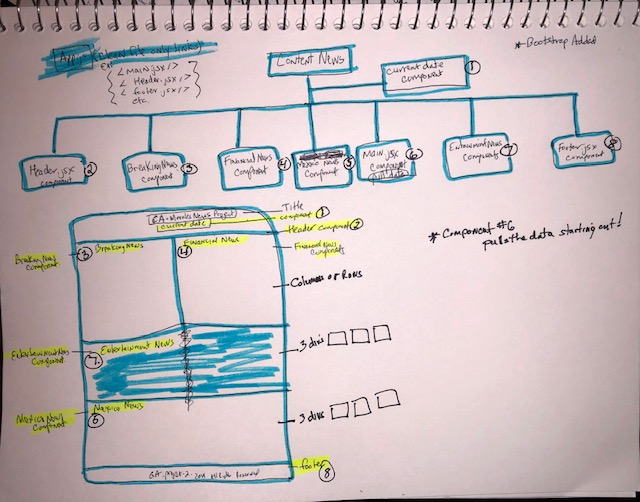
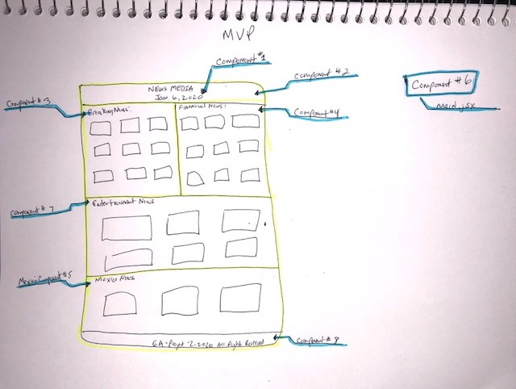

# Collection of Wireframe & Explanation:

The project two API I have chosen is News.org-api. I am looking to add eight components to the project. Within the eight components, five will pull data in order to populate their section of the application with news information. My thought process is to pull data within each of those components but I may see errors forthcoming within my application due to repetitiveness of code.

The forthocoming errors I will plan to fix by researching how to use one pull with several output components with data (news section within app). By drilling down I can fix whatever errors may happen throughout my project. Below you will see a wireframe of what the projects looks like at this time.

# Description of Project:

My project will expose news data on a webpage.  I am building out a site which will pull news information with an api and populate different areas of the site with divs.  

# Major Problems may Face: 

The only problem I may encounter is populating the data onto the section and possible formating of site on divs. 

# Solving the problems: 

I will reseach on stack overflow and several other sites for information about any errors I may receive.  In the event I have errors I cannot fix I will turn to TA for help on an issue.

# Visual of Component Hierarchy:

# Link to API being used: 

https://newsapi.org/v2/top-headlines?country=us&category=business&apiKey=63f2a4bf5bdd42b3bf1f0851aa78b335

# MVP and Post MVP:

