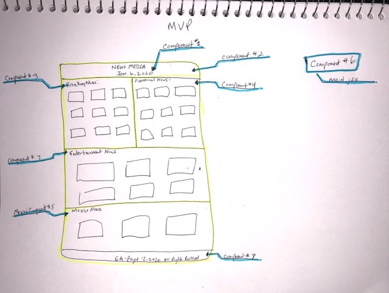
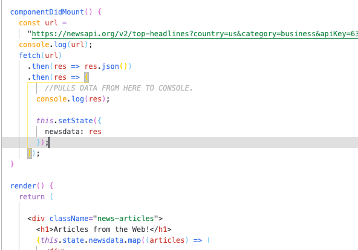

# Project Overview

# Project Description

The project two API I have chosen is News.org-api. I am looking to add eight components to the project. Within the eight components, five will pull data in order to populate their section of the application with news information. the final project goal is to make it look at the first image below. Individual user are able to click on the news data and read the articles.

CNN: https://www.cnn.com
Dailymail: https://www.dailymail.co.uk/ushome/index.html
El Vocero: https://www.elvocero.com

# Project Links

github repo: https://github.com/pmorales4/project2-react-api
Deployment Link: https://pmorales.netlify.com

# Wireframes

Above is the layout of my components and how the site will use the component on a web page. I have labeled each section on wireframe. All components are listed above. To the right you will see five components where a data pull will be used (state).

# MVP / PostMVP - 5min

MVP Example

- API: https://newsapi.org/v2/top-headlines?country=us&category=business&apiKey=63f2a4bf5bdd42b3bf1f0851aa78b335

- API: Several different ones per section on website.
- User can click on news links.

- Pictures shows where API data will be put on site.

# Components

| Component          |                      Description                       |
| ------------------ | :----------------------------------------------------: |
| App                |     This will have all the component links to site     |
| Header             | This will render the header include the Data and title |
| Footer             |        This will render the footer information         |
| Breaking News      |          This will render the BR news section          |
| Financial News     |           This will render Money information           |
| Mexico News        |        This will render Lation News information        |
| Main               |    This will render the inital data pull for state     |
| Entertainment News |          This will render entertainment news           |
| Date               |       This will render the current date on site        |

# Time Frames

| Component               | Priority | Estimated Time | Time Invetsted | Actual Time |
| ----------------------- | :------: | :------------: | :------------: | :---------: |
| API Pull - Each Section |    H     |      hrs       |      hrs       |     hrs     |
| Working with API        |    H     |      hrs       |      hrs       |     hrs     |
| Header                  |    H     |      hrs       |      hrs       |     hrs     |
| Footer                  |    H     |      hrs       |      hrs       |     hrs     |
| Breaking News           |    H     |      hrs       |      hrs       |     hrs     |
| Entertainment News      |    H     |      hrs       |      hrs       |     hrs     |
| Financial News          |    H     |      hrs       |      hrs       |     hrs     |
| Mexico News             |    H     |      hrs       |      hrs       |     hrs     |
| Main.jsx                |    H     |      hrs       |      hrs       |     hrs     |
| Date                    |    H     |      hrs       |      hrs       |     hrs     |

| Total | H | hrs| hrs | hrs |

# Link to API & Site being used:

API: https://newsapi.org/v2/top-headlines?country=us&category=business&apiKey=63f2a4bf5bdd42b3bf1f0851aa78b335

Deployment Link: https://pmorales.netlify.com

## Code Snippet

